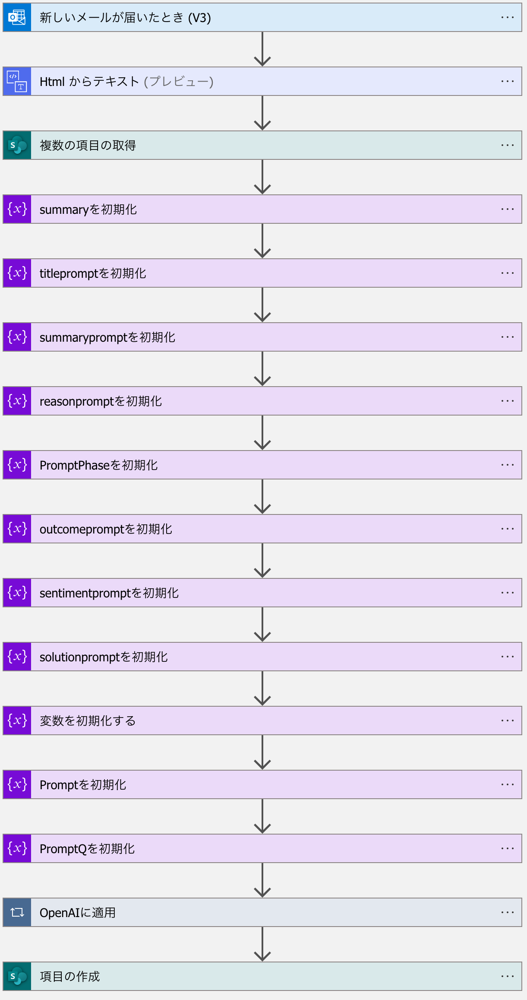

# Azure OpenAI GPT を使用した自動化された分析情報と最適化されたワークフローでビジネスを変革

OpenAIのGPT AIアプリケーションは、業界の流行語になっています。事業運営を強化し、生産性を最大化しようとしているが、技術的な障壁やリソースの制限に遭遇している場合は、この記事で強調表示されているアプリが答えになる可能性があります。
Azure OpenAI をさまざまなビジネス ワークフローにスムーズに統合し、AI を活用したさまざまなデモを紹介します。このデモでは、テクノロジーの機能に焦点を当て、生産性を最適化しながらビジネスオペレーションを合理化するのに役立ちます。


## OpenAIでビジネスプロセスを構築する

**必要なリソース**
- Azure OpenAI Service - 要約とインサイトを取得する
- Power Apps - フロントエンド アプリ部分を担当
- Power Automation* - プロセスの実行基盤

*状況によってはAzure Logic Appsでも代用可能

## 構築方法

1. Azure OpenAI Service - 要約とインサイトを取得する

- まだ利用できない場合には、[ここ](https://learn.microsoft.com/en-us/azure/cognitive-services/openai/overview)からAzure OpenAI Serviceの利用申請を行います。
- 承認後、Azure PortalでAzure OpenAI Serviceのリソースを作成します。
- 今回はリージョンは米国東部(USWest)を選択します。
- [Azure OpenAI Studio](https://oai.azure.com/portal)に移動します。
- リソース内に DaVinci 003 モデルを使用して[デプロイ](https://learn.microsoft.com/en-us/azure/cognitive-services/openai/how-to/create-resource?pivots=web-portal#deploy-a-model)を作成します。


2. 2 つの SharePoint リストを作成する

   -  **質問のプロンプト**（ビジネス要件に応じて質問と promptType を変更します）
   -  電子メール テキストから Open AI で生成された分析情報を保存する **会話のインサイト**（ビジネス要件に応じて列名を変更します）

*質問のプロンプト 作成例*
| タイトル | promptType |
| ------- | ---------- |
| 会話の主な理由 | reason |
| お客様の感情 | sentiment |
| エージェントはどのように会話に対応するか | solution |
| 会話の最終的な結果 | outcome |
| 会話の簡単な要約 | summary |
| 会話の短いタイトル | title |
| お客様の会社名 | customer |


*会話のインサイト 作成例*
| タイトル | お客様名 | sentiment | reason | result | summary | solution | originalText | 対応状況 |
| ------- | ------ | --------- | ------ | ------ | ----- | ------ | ------ | ----- |
|  |  |  |  |  |  |  |  |


### シナリオ 1: 会話の情報分析から始めましょう。電子メールがやりとりされる会話があるとします。電子メールのテキストからいくつかのインサイトを得る必要があります。分析情報を生成するには、PowerAutomate が使用され、結果は SharePoint に保存されます。

3. Power Automate のフローを作成する

   -　フローを作成する手順は次のとおりです。

    1. [flow.microsoft.com](flow.microsoft.com) に移動し、「サインイン」をクリックします。
    2. https://make.powerautomate.com/ に移動します。
    3. 「＋作成」をクリックし、「自動化されたクラウド フロー」をクリックし、「OpenAI-Insights」という名前をつけます。
    4. 下記のように、複数のプロンプトに対応する変数を作成し、SharePoint リストに一つの会話からそれぞれの列に分析情報を保存します。



   5. プロンプトを増やした場合にはその内容に応じてフローを構成します。
   6. **新しいメールが届いたとき (V3)** - メールの会話からインサイトを得るためのソースとして使用する場合は、メールトリガーを選択します。それ以外の場合は、会話の保存場所に応じて、他のトリガーを使用できます。 たとえば、Teams チャット、SharePoint ストレージ、BLOB ストレージ、その他のストレージ ソリューションなどがあります。
   7. **HtmlToText** - テキストへのコネクタを使用して、電子メール本文をプレーンテキストとして取得します。
   8. **複数の項目の取得** - SharePoint コネクタを使用して、電子メール テキストに対してプロンプト リストを実行して追加の分析情報を取得します。
   9. **変数の初期化** - 変数の初期化の数はプロンプトの数に基づいて作成します
   10. 出力を格納するために Summary という変数を初期化します。
   11. **OPEN AIに適用** - 元の会話テキストに対して各プロンプトの質問をループしてインサイトを取得し、caseステートメントを介して初期化されたそれぞれの変数に結果を保存します。

*HTTPコネクタの記述例*

```HTML
Method: POST
URI: https://<your_aoai_endpoint>.openai.azure.com/openai/deployments/<your_gpt_model_name>/completions?api-version=2022-12-...
Headers content-type:application/json
                api-key: <your_aoai_api_key> [Azure Portal -> OpenAI resource -> Keys & Endpoints]
Body   {
"prompt": @{variables('promptPhrase')},
"max_tokens": 1000,
"temperature": 1
}
```


**JSON の解析** - 先ほどのHTTPからの応答を解析します。
「サンプルのペイロードを使用してスキーマを生成する」をクリックして、下記のJSONサンプルの内容を貼り付けて解析を行います。

```json
{
"body": {
"id": "cmpl-xxxxxxx",
"object": "text_completion",
"created": 1678909613,
"model": "text-davinci-003",
"choices": [
{
"text": "\nThe main reason of the conversation is to give credit to travel company for their gracious refund of the cost of the no-show.",
"index": 0,
"finish_reason": "stop",
"logprobs": null
}
],
"usage": {
"completion_tokens": 27,
"prompt_tokens": 91,
"total_tokens": 118
}
}
} 
```


解析後、配列をループし、各アクションに適用変数にテキストを割り当てる必要があります。 配列プロパティとして 「解析ステップの出力から選択肢」 を選択します。

**出力の設定** - 変数 「summary」

**スイッチ** - HTTP Post呼び出しに基づいて各変数を設定するためのプロンプトの数に基づいて6つのケースアクションがあります（このRepositoryの例では7個）。


*上記11（ここでは12）個のステップで **OPEN AIに適用** は完了です（各プロンプトの質問をループし、OpenAI エンドポイントを呼び出して分析情報を取得します。応答を解析し、各プロンプト関連変数に保存します）*

 12. **項目の作成** - すべての変数を設定したら、元のテキストと追加の分析情報を含むエントリを SharePoint 会話分析情報リストに作成します。


## 業務プロセスで分析情報を活用する方法

PowerApps を SharePoint リストを使用して作成し、各顧客との会話で OpenAI によって生成された分析情報に関するビジネス プロセスを作成できます。

ダッシュボード -> 詳細画面 -> インサイトと共に会話を処理する

https://learn.microsoft.com/en-us/power-apps/maker/canvas-apps/app-from-sharepoint 

**ダッシュボード** - SharePoint を使用した PowerApps の垂直ギャラリーでは、データ ソースとして "会話の分析情報" を一覧表示します。


**項目の詳細**ページでは、顧客サービスを加速するための OpenAI インサイトが含まれます - PowerApps でフォームを表示


##　Stay tuned for more exciting blog content as we explore various potential scenarios.

Effortlessly extract text from documents, audio, and video files to generate valuable insights.

[Transform your business with automated insights & optimized workflows using Azure OpenAI GPT-3](https://techcommunity.microsoft.com/t5/ai-cognitive-services-blog/transform-your-business-with-automated-insights-amp-optimized/ba-p/3771392)